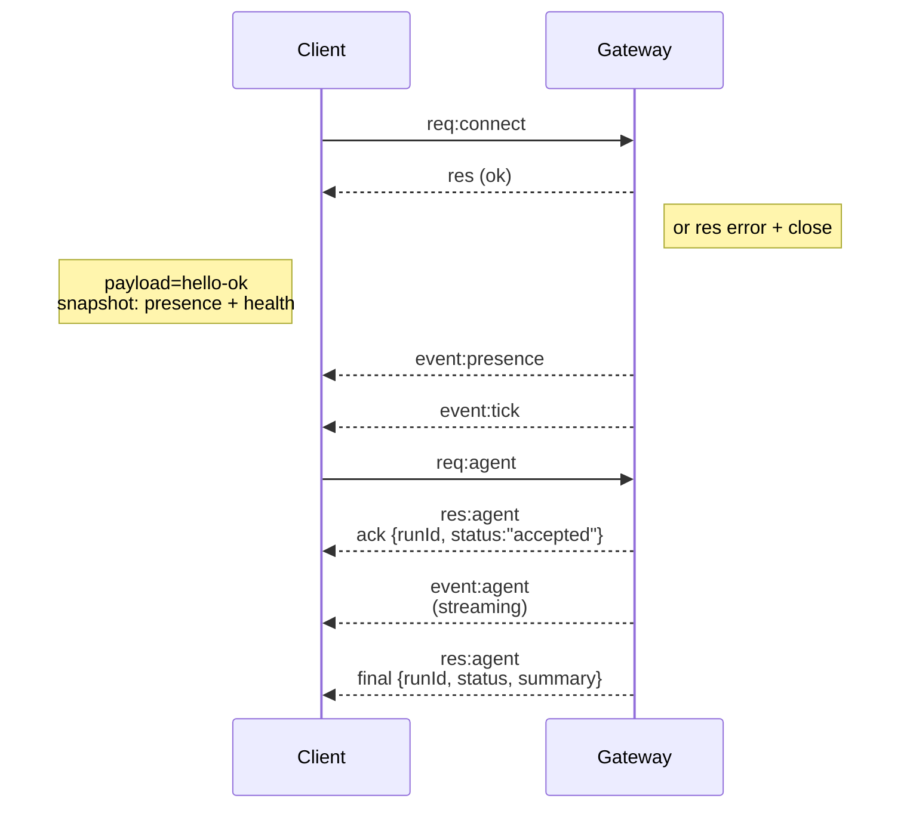

# OpenClaw Architecture

<!-- AUTO-GENERATED — do not edit by hand. Regenerate: pnpm arch:gen -->
<!-- version: 2026.4.3 -->

> This document is auto-generated from the codebase. It provides architectural orientation
> for AI coding assistants (Claude Code, Codex) and human developers.
> Run `pnpm arch:gen` to refresh. Validate with `pnpm arch:check`.

---

## System Overview

OpenClaw is Multi-channel AI gateway with extensible messaging integrations.

OpenClaw is the AI that actually does things. It runs on your devices, in your channels, with your rules.

| Property        | Value                                |
| --------------- | ------------------------------------ |
| Version         | 2026.4.3                             |
| Runtime         | Node >=22.14.0, TypeScript ESM       |
| Package Manager | pnpm (workspace monorepo)            |
| Repository      | https://github.com/openclaw/openclaw |

---

## Component Map

### Source Modules (`src/`)

| Module                | Has Boundary Guide         |
| --------------------- | -------------------------- |
| `acp`                 | —                          |
| `agents`              | —                          |
| `auto-reply`          | —                          |
| `bindings`            | —                          |
| `bootstrap`           | —                          |
| `canvas-host`         | —                          |
| `channels`            | `src/channels/AGENTS.md`   |
| `chat`                | —                          |
| `cli`                 | —                          |
| `commands`            | —                          |
| `compat`              | —                          |
| `config`              | —                          |
| `context-engine`      | —                          |
| `cron`                | —                          |
| `daemon`              | —                          |
| `docs`                | —                          |
| `flows`               | —                          |
| `gateway`             | —                          |
| `generated`           | —                          |
| `hooks`               | —                          |
| `i18n`                | —                          |
| `image-generation`    | —                          |
| `infra`               | —                          |
| `interactive`         | —                          |
| `link-understanding`  | —                          |
| `logging`             | —                          |
| `markdown`            | —                          |
| `mcp`                 | —                          |
| `media`               | —                          |
| `media-understanding` | —                          |
| `node-host`           | —                          |
| `pairing`             | —                          |
| `plugin-sdk`          | `src/plugin-sdk/AGENTS.md` |
| `plugins`             | `src/plugins/AGENTS.md`    |
| `process`             | —                          |
| `routing`             | —                          |
| `scripts`             | —                          |
| `secrets`             | —                          |
| `security`            | —                          |
| `sessions`            | —                          |
| `shared`              | —                          |
| `tasks`               | —                          |
| `terminal`            | —                          |
| `test-helpers`        | —                          |
| `test-utils`          | —                          |
| `tts`                 | —                          |
| `tui`                 | —                          |
| `types`               | —                          |
| `utils`               | —                          |
| `web-fetch`           | —                          |
| `web-search`          | —                          |
| `wizard`              | —                          |

### Architecture Boundary Guides

| Path                                       | Summary                                                                          |
| ------------------------------------------ | -------------------------------------------------------------------------------- |
| `AGENTS.md`                                | - Repo: https://github.com/openclaw/openclaw                                     |
| `docs/reference/templates/AGENTS.md`       | ---                                                                              |
| `docs/zh-CN/AGENTS.md`                     | - 维护 `docs/zh-CN/**`                                                           |
| `docs/zh-CN/reference/templates/AGENTS.md` | ---                                                                              |
| `extensions/AGENTS.md`                     | This directory contains bundled plugins. Treat it as the same boundary that      |
| `src/channels/AGENTS.md`                   | `src/channels/**` is core channel implementation. Plugin authors should not      |
| `src/gateway/protocol/AGENTS.md`           | This directory defines the Gateway wire contract for operator clients and        |
| `src/gateway/server-methods/AGENTS.md`     | - Pi session transcripts are a `parentId` chain/DAG; never append Pi `type: "…   |
| `src/plugin-sdk/AGENTS.md`                 | This directory is the public contract between plugins and core. Changes here     |
| `src/plugins/AGENTS.md`                    | This directory owns plugin discovery, manifest validation, loading, registry     |
| `test/helpers/channels/AGENTS.md`          | This directory holds shared channel test helpers used by core and bundled plugin |

---

## Architecture Boundaries

### `src/channels/`

# Channels Boundary

`src/channels/**` is core channel implementation. Plugin authors should not
import from this tree directly.

## Public Contracts

- Docs:
  - `docs/plugins/sdk-channel-plugins.md`
  - `docs/plugins/architecture.md`
  - `docs/plugins/sdk-overview.md`
- Definition files:
  - `src/channels/plugins/types.plugin.ts`
  - `src/channels/plugins/types.core.ts`
  - `src/channels/plugins/types.adapters.ts`
  - `src/plugin-sdk/core.ts`
  - `src/plugin-sdk/channel-contract.ts`

## Boundary Rules

- Keep extension-facing channel surfaces flowing through `openclaw/plugin-sdk/*`
  instead of direct imports from `src/channels/**`.
- When a bundled or third-party channel needs a new seam, add a typed SDK
  contract or facade first.
- Remember that shared channel changes affect both built-in and extension
  channels. Check routing, pairing, allowlists, command gating, onboarding, and
  reply behavior across the full set.

### `src/gateway/protocol/`

# Gateway Protocol Boundary

This directory defines the Gateway wire contract for operator clients and
nodes.

## Public Contracts

- Docs:
  - `docs/gateway/protocol.md`
  - `docs/gateway/bridge-protocol.md`
  - `docs/concepts/architecture.md`
- Definition files:
  - `src/gateway/protocol/schema.ts`
  - `src/gateway/protocol/schema/*.ts`
  - `src/gateway/protocol/index.ts`

## Boundary Rules

- Treat schema changes as protocol changes, not local refactors.
- Prefer additive evolution. If a change is incompatible, handle versioning
  explicitly and update all affected clients.
- Keep schema, runtime validators, docs, tests, and generated client artifacts
  in sync.
- New Gateway methods, events, or payload fields should land through the typed
  protocol definitions here rather than ad hoc JSON shapes elsewhere.

### `src/gateway/server-methods/`

# Gateway Server Methods Notes

- Pi session transcripts are a `parentId` chain/DAG; never append Pi `type: "message"` entries via raw JSONL writes (missing `parentId` can sever the leaf path and break compaction/history). Always write transcript messages via `SessionManager.appendMessage(...)` (or a wrapper that uses it).

### `src/plugin-sdk/`

# Plugin SDK Boundary

This directory is the public contract between plugins and core. Changes here
can affect bundled plugins and third-party plugins.

## Source Of Truth

- Docs:
  - `docs/plugins/sdk-overview.md`
  - `docs/plugins/sdk-entrypoints.md`
  - `docs/plugins/sdk-runtime.md`
  - `docs/plugins/sdk-migration.md`
  - `docs/plugins/architecture.md`
- Definition files:
  - `package.json`
  - `scripts/lib/plugin-sdk-entrypoints.json`
  - `src/plugin-sdk/entrypoints.ts`
  - `src/plugin-sdk/api-baseline.ts`
  - `src/plugin-sdk/plugin-entry.ts`
  - `src/plugin-sdk/core.ts`
  - `src/plugin-sdk/provider-entry.ts`

## Boundary Rules

- Prefer narrow, purpose-built subpaths over broad convenience re-exports.
- Do not expose implementation convenience from `src/channels/**`,
  `src/agents/**`, `src/plugins/**`, or other internals unless you are
  intentionally promoting a supported public contract.
- Prefer `api.runtime` or a focused SDK facade over telling extensions to reach
  into host internals directly.
- When core or tests need bundled plugin helpers, prefer the plugin package
  `api.ts` or `runtime-api.ts` plus generic SDK capabilities. Do not add a
  provider-named `src/plugin-sdk/<id>.ts` seam just to make core aware of a
  bundled channel's private helpers.

## Expanding The Boundary

- Additive, backwards-compatible changes are the default.
- When adding or changing a public subpath, keep these aligned:
  - docs in `docs/plugins/*`
  - `scripts/lib/plugin-sdk-entrypoints.json`
  - `src/plugin-sdk/entrypoints.ts`
  - `package.json` exports
  - API baseline and export checks
- If a bundled channel/helper need crosses package boundaries, first ask
  whether the need is truly generic. If yes, add a narrow generic subpath. If
  not, keep it plugin-local through `api.ts` / `runtime-api.ts`.
- Breaking removals or renames are major-version work, not drive-by cleanup.

### `src/plugins/`

# Plugins Boundary

This directory owns plugin discovery, manifest validation, loading, registry
assembly, and contract enforcement.

## Public Contracts

- Docs:
  - `docs/plugins/architecture.md`
  - `docs/plugins/manifest.md`
  - `docs/plugins/sdk-overview.md`
  - `docs/plugins/sdk-entrypoints.md`
- Definition files:
  - `src/plugins/types.ts`
  - `src/plugins/runtime/types.ts`
  - `src/plugins/contracts/registry.ts`
  - `src/plugins/public-artifacts.ts`

## Boundary Rules

- Preserve manifest-first behavior: discovery, config validation, and setup
  should work from metadata before plugin runtime executes.
- Keep loader behavior aligned with the documented Plugin SDK and manifest
  contracts. Do not create private backdoors that bundled plugins can use but
  external plugins cannot.
- If a loader or registry change affects plugin authors, update the public SDK,
  docs, and contract tests instead of relying on incidental internals.
- Do not normalize "plugin-owned" into "core-owned" by scattering direct reads
  of `plugins.entries.<id>.config` through unrelated core paths. Prefer generic
  helpers, plugin runtime hooks, manifest metadata, and explicit auto-enable
  wiring.
- When plugin-owned tools or provider fallbacks need core participation, keep
  the contract generic and honor plugin disablement plus SecretRef semantics.
- Keep contract loading and contract tests on the dedicated bundled registry
  path. Do not make contract validation depend on activating providers through
  unrelated production resolution flows.

### `extensions/`

# Extensions Boundary

This directory contains bundled plugins. Treat it as the same boundary that
third-party plugins see.

## Public Contracts

- Docs:
  - `docs/plugins/building-plugins.md`
  - `docs/plugins/architecture.md`
  - `docs/plugins/sdk-overview.md`
  - `docs/plugins/sdk-entrypoints.md`
  - `docs/plugins/sdk-runtime.md`
  - `docs/plugins/sdk-channel-plugins.md`
  - `docs/plugins/sdk-provider-plugins.md`
  - `docs/plugins/manifest.md`
- Definition files:
  - `src/plugin-sdk/plugin-entry.ts`
  - `src/plugin-sdk/core.ts`
  - `src/plugin-sdk/provider-entry.ts`
  - `src/plugin-sdk/channel-contract.ts`
  - `scripts/lib/plugin-sdk-entrypoints.json`
  - `package.json`

## Boundary Rules

- Extension production code should import from `openclaw/plugin-sdk/*` and its
  own local barrels such as `./api.ts` and `./runtime-api.ts`.
- Do not import core internals from `src/**`, `src/channels/**`,
  `src/plugin-sdk-internal/**`, or another extension's `src/**`.
- Do not use relative imports that escape the current extension package root.
- Keep plugin metadata accurate in `openclaw.plugin.json` and the package
  `openclaw` block so discovery and setup work without executing plugin code.
- Treat files like `src/**`, `onboard.ts`, and other local helpers as private
  unless you intentionally promote them through `api.ts` and, if needed, a
  matching `src/plugin-sdk/<id>.ts` facade.
- If core or core tests need a bundled plugin helper, export it from `api.ts`
  first instead of letting them deep-import extension internals.

## Expanding The Boundary

- If an extension needs a new seam, add a typed Plugin SDK subpath or additive
  export instead of reaching into core.
- Keep new plugin-facing seams backwards-compatible and versioned. Third-party
  plugins consume this surface.
- When intentionally expanding the contract, update the docs, exported subpath
  list, package exports, and API/contract checks in the same change.

### `test/helpers/channels/`

# Test Helper Boundary

This directory holds shared channel test helpers used by core and bundled plugin
tests.

## Bundled Plugin Imports

- Core test helpers in this directory must not hardcode repo-relative imports
  into `extensions/**`.
- When a helper needs a bundled plugin public/test surface, go through
  `src/test-utils/bundled-plugin-public-surface.ts`.
- Prefer `loadBundledPluginTestApiSync(...)` for eager access to exported test
  helpers.
- Prefer `resolveRelativeBundledPluginPublicModuleId(...)` when a test needs a
  module id for dynamic import or mocking.
- If `vi.mock(...)` hoisting would evaluate the module id too early, use
  `vi.doMock(...)` with the resolved module id instead of falling back to a
  hardcoded path.

## Intent

- Keep shared test helpers aligned with the same public/plugin boundary that
  production code uses.
- Avoid drift where core test helpers start reaching into bundled plugin private
  files by path because it is convenient in one test.

---

## Boundary Violations

3 potential violation(s) detected in `extensions/`.

| Location                                                             | Import                                                 | Violation Type  |
| -------------------------------------------------------------------- | ------------------------------------------------------ | --------------- |
| `extensions/browser/test-support.ts:8`                               | `../../src/test-utils/auth-token-assertions.js`        | relative-escape |
| `extensions/telegram/src/test-support/inbound-context-contract.ts:1` | `../../../../src/channels/plugins/contracts/suites.js` | relative-escape |
| `extensions/telegram/src/test-support/write-skill.ts:1`              | `../../../../src/agents/skills.e2e-test-helpers.js`    | relative-escape |

---

## Data Flow

### Gateway Wire Protocol

> Source: `docs/concepts/architecture.md`

## Components and flows

### Gateway (daemon)

- Maintains provider connections.
- Exposes a typed WS API (requests, responses, server‑push events).
- Validates inbound frames against JSON Schema.
- Emits events like `agent`, `chat`, `presence`, `health`, `heartbeat`, `cron`.

### Clients (mac app / CLI / web admin)

- One WS connection per client.
- Send requests (`health`, `status`, `send`, `agent`, `system-presence`).
- Subscribe to events (`tick`, `agent`, `presence`, `shutdown`).

### Nodes (macOS / iOS / Android / headless)

- Connect to the **same WS server** with `role: node`.
- Provide a device identity in `connect`; pairing is **device‑based** (role `node`) and
  approval lives in the device pairing store.
- Expose commands like `canvas.*`, `camera.*`, `screen.record`, `location.get`.

Protocol details:

- [Gateway protocol](/gateway/protocol)

### WebChat

- Static UI that uses the Gateway WS API for chat history and sends.
- In remote setups, connects through the same SSH/Tailscale tunnel as other
  clients.

## Connection lifecycle (single client)

## Wire protocol (summary)

- Transport: WebSocket, text frames with JSON payloads.
- First frame **must** be `connect`.
- After handshake:
  - Requests: `{type:"req", id, method, params}` → `{type:"res", id, ok, payload|error}`
  - Events: `{type:"event", event, payload, seq?, stateVersion?}`
- If `OPENCLAW_GATEWAY_TOKEN` (or `--token`) is set, `connect.params.auth.token`
  must match or the socket closes.
- Idempotency keys are required for side‑effecting methods (`send`, `agent`) to
  safely retry; the server keeps a short‑lived dedupe cache.
- Nodes must include `role: "node"` plus caps/commands/permissions in `connect`.

### Agent Execution Cycle

> Source: `docs/concepts/agent-loop.md`

1. `agent` RPC validates params, resolves session (sessionKey/sessionId), persists session metadata, returns `{ runId, acceptedAt }` immediately.
2. `agentCommand` runs the agent:
   - resolves model + thinking/verbose defaults
   - loads skills snapshot
   - calls `runEmbeddedPiAgent` (pi-agent-core runtime)
   - emits **lifecycle end/error** if the embedded loop does not emit one
3. `runEmbeddedPiAgent`:
   - serializes runs via per-session + global queues
   - resolves model + auth profile and builds the pi session
   - subscribes to pi events and streams assistant/tool deltas
   - enforces timeout -> aborts run if exceeded
   - returns payloads + usage metadata
4. `subscribeEmbeddedPiSession` bridges pi-agent-core events to OpenClaw `agent` stream:
   - tool events => `stream: "tool"`
   - assistant deltas => `stream: "assistant"`
   - lifecycle events => `stream: "lifecycle"` (`phase: "start" | "end" | "error"`)
5. `agent.wait` uses `waitForAgentJob`:
   - waits for **lifecycle end/error** for `runId`
   - returns `{ status: ok|error|timeout, startedAt, endedAt, error? }`

---

## Plugin SDK Public Surface

The Plugin SDK (`src/plugin-sdk/`) contains 273 source files exposing 218 public subpaths.

### Exported Subpaths

| Subpath                                                  | Entry                                                  |
| -------------------------------------------------------- | ------------------------------------------------------ |
| `openclaw/plugin-sdk`                                    | `src/plugin-sdk/index.ts`                              |
| `openclaw/plugin-sdk/account-core`                       | `src/plugin-sdk/account-core.ts`                       |
| `openclaw/plugin-sdk/account-helpers`                    | `src/plugin-sdk/account-helpers.ts`                    |
| `openclaw/plugin-sdk/account-id`                         | `src/plugin-sdk/account-id.ts`                         |
| `openclaw/plugin-sdk/account-resolution`                 | `src/plugin-sdk/account-resolution.ts`                 |
| `openclaw/plugin-sdk/acp-runtime`                        | `src/plugin-sdk/acp-runtime.ts`                        |
| `openclaw/plugin-sdk/agent-config-primitives`            | `src/plugin-sdk/agent-config-primitives.ts`            |
| `openclaw/plugin-sdk/agent-runtime`                      | `src/plugin-sdk/agent-runtime.ts`                      |
| `openclaw/plugin-sdk/allow-from`                         | `src/plugin-sdk/allow-from.ts`                         |
| `openclaw/plugin-sdk/allowlist-config-edit`              | `src/plugin-sdk/allowlist-config-edit.ts`              |
| `openclaw/plugin-sdk/amazon-bedrock`                     | `src/plugin-sdk/amazon-bedrock.ts`                     |
| `openclaw/plugin-sdk/anthropic-vertex`                   | `src/plugin-sdk/anthropic-vertex.ts`                   |
| `openclaw/plugin-sdk/approval-runtime`                   | `src/plugin-sdk/approval-runtime.ts`                   |
| `openclaw/plugin-sdk/bluebubbles`                        | `src/plugin-sdk/bluebubbles.ts`                        |
| `openclaw/plugin-sdk/bluebubbles-policy`                 | `src/plugin-sdk/bluebubbles-policy.ts`                 |
| `openclaw/plugin-sdk/boolean-param`                      | `src/plugin-sdk/boolean-param.ts`                      |
| `openclaw/plugin-sdk/browser`                            | `src/plugin-sdk/browser.ts`                            |
| `openclaw/plugin-sdk/browser-runtime`                    | `src/plugin-sdk/browser-runtime.ts`                    |
| `openclaw/plugin-sdk/browser-support`                    | `src/plugin-sdk/browser-support.ts`                    |
| `openclaw/plugin-sdk/byteplus`                           | `src/plugin-sdk/byteplus.ts`                           |
| `openclaw/plugin-sdk/channel-actions`                    | `src/plugin-sdk/channel-actions.ts`                    |
| `openclaw/plugin-sdk/channel-config-helpers`             | `src/plugin-sdk/channel-config-helpers.ts`             |
| `openclaw/plugin-sdk/channel-config-primitives`          | `src/plugin-sdk/channel-config-primitives.ts`          |
| `openclaw/plugin-sdk/channel-config-schema`              | `src/plugin-sdk/channel-config-schema.ts`              |
| `openclaw/plugin-sdk/channel-config-writes`              | `src/plugin-sdk/channel-config-writes.ts`              |
| `openclaw/plugin-sdk/channel-contract`                   | `src/plugin-sdk/channel-contract.ts`                   |
| `openclaw/plugin-sdk/channel-feedback`                   | `src/plugin-sdk/channel-feedback.ts`                   |
| `openclaw/plugin-sdk/channel-inbound`                    | `src/plugin-sdk/channel-inbound.ts`                    |
| `openclaw/plugin-sdk/channel-lifecycle`                  | `src/plugin-sdk/channel-lifecycle.ts`                  |
| `openclaw/plugin-sdk/channel-pairing`                    | `src/plugin-sdk/channel-pairing.ts`                    |
| `openclaw/plugin-sdk/channel-policy`                     | `src/plugin-sdk/channel-policy.ts`                     |
| `openclaw/plugin-sdk/channel-reply-pipeline`             | `src/plugin-sdk/channel-reply-pipeline.ts`             |
| `openclaw/plugin-sdk/channel-runtime`                    | `src/plugin-sdk/channel-runtime.ts`                    |
| `openclaw/plugin-sdk/channel-send-result`                | `src/plugin-sdk/channel-send-result.ts`                |
| `openclaw/plugin-sdk/channel-setup`                      | `src/plugin-sdk/channel-setup.ts`                      |
| `openclaw/plugin-sdk/channel-status`                     | `src/plugin-sdk/channel-status.ts`                     |
| `openclaw/plugin-sdk/channel-targets`                    | `src/plugin-sdk/channel-targets.ts`                    |
| `openclaw/plugin-sdk/chutes`                             | `src/plugin-sdk/chutes.ts`                             |
| `openclaw/plugin-sdk/cli-backend`                        | `src/plugin-sdk/cli-backend.ts`                        |
| `openclaw/plugin-sdk/cli-runtime`                        | `src/plugin-sdk/cli-runtime.ts`                        |
| `openclaw/plugin-sdk/cloudflare-ai-gateway`              | `src/plugin-sdk/cloudflare-ai-gateway.ts`              |
| `openclaw/plugin-sdk/collection-runtime`                 | `src/plugin-sdk/collection-runtime.ts`                 |
| `openclaw/plugin-sdk/command-auth`                       | `src/plugin-sdk/command-auth.ts`                       |
| `openclaw/plugin-sdk/command-auth-native`                | `src/plugin-sdk/command-auth-native.ts`                |
| `openclaw/plugin-sdk/command-detection`                  | `src/plugin-sdk/command-detection.ts`                  |
| `openclaw/plugin-sdk/command-surface`                    | `src/plugin-sdk/command-surface.ts`                    |
| `openclaw/plugin-sdk/compat`                             | `src/plugin-sdk/compat.ts`                             |
| `openclaw/plugin-sdk/config-runtime`                     | `src/plugin-sdk/config-runtime.ts`                     |
| `openclaw/plugin-sdk/conversation-runtime`               | `src/plugin-sdk/conversation-runtime.ts`               |
| `openclaw/plugin-sdk/core`                               | `src/plugin-sdk/core.ts`                               |
| `openclaw/plugin-sdk/dangerous-name-runtime`             | `src/plugin-sdk/dangerous-name-runtime.ts`             |
| `openclaw/plugin-sdk/deepseek`                           | `src/plugin-sdk/deepseek.ts`                           |
| `openclaw/plugin-sdk/device-bootstrap`                   | `src/plugin-sdk/device-bootstrap.ts`                   |
| `openclaw/plugin-sdk/diagnostic-runtime`                 | `src/plugin-sdk/diagnostic-runtime.ts`                 |
| `openclaw/plugin-sdk/diagnostics-otel`                   | `src/plugin-sdk/diagnostics-otel.ts`                   |
| `openclaw/plugin-sdk/diffs`                              | `src/plugin-sdk/diffs.ts`                              |
| `openclaw/plugin-sdk/direct-dm`                          | `src/plugin-sdk/direct-dm.ts`                          |
| `openclaw/plugin-sdk/directory-runtime`                  | `src/plugin-sdk/directory-runtime.ts`                  |
| `openclaw/plugin-sdk/error-runtime`                      | `src/plugin-sdk/error-runtime.ts`                      |
| `openclaw/plugin-sdk/extension-shared`                   | `src/plugin-sdk/extension-shared.ts`                   |
| `openclaw/plugin-sdk/feishu`                             | `src/plugin-sdk/feishu.ts`                             |
| `openclaw/plugin-sdk/feishu-conversation`                | `src/plugin-sdk/feishu-conversation.ts`                |
| `openclaw/plugin-sdk/feishu-setup`                       | `src/plugin-sdk/feishu-setup.ts`                       |
| `openclaw/plugin-sdk/fetch-runtime`                      | `src/plugin-sdk/fetch-runtime.ts`                      |
| `openclaw/plugin-sdk/file-lock`                          | `src/plugin-sdk/file-lock.ts`                          |
| `openclaw/plugin-sdk/gateway-runtime`                    | `src/plugin-sdk/gateway-runtime.ts`                    |
| `openclaw/plugin-sdk/github-copilot-login`               | `src/plugin-sdk/github-copilot-login.ts`               |
| `openclaw/plugin-sdk/github-copilot-token`               | `src/plugin-sdk/github-copilot-token.ts`               |
| `openclaw/plugin-sdk/global-singleton`                   | `src/plugin-sdk/global-singleton.ts`                   |
| `openclaw/plugin-sdk/google`                             | `src/plugin-sdk/google.ts`                             |
| `openclaw/plugin-sdk/googlechat`                         | `src/plugin-sdk/googlechat.ts`                         |
| `openclaw/plugin-sdk/group-access`                       | `src/plugin-sdk/group-access.ts`                       |
| `openclaw/plugin-sdk/hook-runtime`                       | `src/plugin-sdk/hook-runtime.ts`                       |
| `openclaw/plugin-sdk/host-runtime`                       | `src/plugin-sdk/host-runtime.ts`                       |
| `openclaw/plugin-sdk/huggingface`                        | `src/plugin-sdk/huggingface.ts`                        |
| `openclaw/plugin-sdk/image-generation`                   | `src/plugin-sdk/image-generation.ts`                   |
| `openclaw/plugin-sdk/image-generation-core`              | `src/plugin-sdk/image-generation-core.ts`              |
| `openclaw/plugin-sdk/infra-runtime`                      | `src/plugin-sdk/infra-runtime.ts`                      |
| `openclaw/plugin-sdk/interactive-runtime`                | `src/plugin-sdk/interactive-runtime.ts`                |
| `openclaw/plugin-sdk/irc`                                | `src/plugin-sdk/irc.ts`                                |
| `openclaw/plugin-sdk/irc-surface`                        | `src/plugin-sdk/irc-surface.ts`                        |
| `openclaw/plugin-sdk/json-store`                         | `src/plugin-sdk/json-store.ts`                         |
| `openclaw/plugin-sdk/keyed-async-queue`                  | `src/plugin-sdk/keyed-async-queue.ts`                  |
| `openclaw/plugin-sdk/kilocode`                           | `src/plugin-sdk/kilocode.ts`                           |
| `openclaw/plugin-sdk/kimi-coding`                        | `src/plugin-sdk/kimi-coding.ts`                        |
| `openclaw/plugin-sdk/lazy-runtime`                       | `src/plugin-sdk/lazy-runtime.ts`                       |
| `openclaw/plugin-sdk/line`                               | `src/plugin-sdk/line.ts`                               |
| `openclaw/plugin-sdk/line-core`                          | `src/plugin-sdk/line-core.ts`                          |
| `openclaw/plugin-sdk/line-runtime`                       | `src/plugin-sdk/line-runtime.ts`                       |
| `openclaw/plugin-sdk/line-surface`                       | `src/plugin-sdk/line-surface.ts`                       |
| `openclaw/plugin-sdk/llm-task`                           | `src/plugin-sdk/llm-task.ts`                           |
| `openclaw/plugin-sdk/logging-core`                       | `src/plugin-sdk/logging-core.ts`                       |
| `openclaw/plugin-sdk/markdown-table-runtime`             | `src/plugin-sdk/markdown-table-runtime.ts`             |
| `openclaw/plugin-sdk/matrix`                             | `src/plugin-sdk/matrix.ts`                             |
| `openclaw/plugin-sdk/matrix-helper`                      | `src/plugin-sdk/matrix-helper.ts`                      |
| `openclaw/plugin-sdk/matrix-runtime-heavy`               | `src/plugin-sdk/matrix-runtime-heavy.ts`               |
| `openclaw/plugin-sdk/matrix-runtime-shared`              | `src/plugin-sdk/matrix-runtime-shared.ts`              |
| `openclaw/plugin-sdk/matrix-runtime-surface`             | `src/plugin-sdk/matrix-runtime-surface.ts`             |
| `openclaw/plugin-sdk/matrix-surface`                     | `src/plugin-sdk/matrix-surface.ts`                     |
| `openclaw/plugin-sdk/matrix-thread-bindings`             | `src/plugin-sdk/matrix-thread-bindings.ts`             |
| `openclaw/plugin-sdk/mattermost`                         | `src/plugin-sdk/mattermost.ts`                         |
| `openclaw/plugin-sdk/mattermost-policy`                  | `src/plugin-sdk/mattermost-policy.ts`                  |
| `openclaw/plugin-sdk/media-runtime`                      | `src/plugin-sdk/media-runtime.ts`                      |
| `openclaw/plugin-sdk/media-understanding`                | `src/plugin-sdk/media-understanding.ts`                |
| `openclaw/plugin-sdk/media-understanding-runtime`        | `src/plugin-sdk/media-understanding-runtime.ts`        |
| `openclaw/plugin-sdk/memory-core`                        | `src/plugin-sdk/memory-core.ts`                        |
| `openclaw/plugin-sdk/memory-core-engine-runtime`         | `src/plugin-sdk/memory-core-engine-runtime.ts`         |
| `openclaw/plugin-sdk/memory-core-host-engine-embeddings` | `src/plugin-sdk/memory-core-host-engine-embeddings.ts` |
| `openclaw/plugin-sdk/memory-core-host-engine-foundation` | `src/plugin-sdk/memory-core-host-engine-foundation.ts` |
| `openclaw/plugin-sdk/memory-core-host-engine-qmd`        | `src/plugin-sdk/memory-core-host-engine-qmd.ts`        |
| `openclaw/plugin-sdk/memory-core-host-engine-storage`    | `src/plugin-sdk/memory-core-host-engine-storage.ts`    |
| `openclaw/plugin-sdk/memory-core-host-multimodal`        | `src/plugin-sdk/memory-core-host-multimodal.ts`        |
| `openclaw/plugin-sdk/memory-core-host-query`             | `src/plugin-sdk/memory-core-host-query.ts`             |
| `openclaw/plugin-sdk/memory-core-host-runtime-cli`       | `src/plugin-sdk/memory-core-host-runtime-cli.ts`       |
| `openclaw/plugin-sdk/memory-core-host-runtime-core`      | `src/plugin-sdk/memory-core-host-runtime-core.ts`      |
| `openclaw/plugin-sdk/memory-core-host-runtime-files`     | `src/plugin-sdk/memory-core-host-runtime-files.ts`     |
| `openclaw/plugin-sdk/memory-core-host-secret`            | `src/plugin-sdk/memory-core-host-secret.ts`            |
| `openclaw/plugin-sdk/memory-core-host-status`            | `src/plugin-sdk/memory-core-host-status.ts`            |
| `openclaw/plugin-sdk/memory-lancedb`                     | `src/plugin-sdk/memory-lancedb.ts`                     |
| `openclaw/plugin-sdk/minimax`                            | `src/plugin-sdk/minimax.ts`                            |
| `openclaw/plugin-sdk/mistral`                            | `src/plugin-sdk/mistral.ts`                            |
| `openclaw/plugin-sdk/models-provider-runtime`            | `src/plugin-sdk/models-provider-runtime.ts`            |
| `openclaw/plugin-sdk/modelstudio`                        | `src/plugin-sdk/modelstudio.ts`                        |
| `openclaw/plugin-sdk/modelstudio-definitions`            | `src/plugin-sdk/modelstudio-definitions.ts`            |
| `openclaw/plugin-sdk/moonshot`                           | `src/plugin-sdk/moonshot.ts`                           |
| `openclaw/plugin-sdk/msteams`                            | `src/plugin-sdk/msteams.ts`                            |
| `openclaw/plugin-sdk/native-command-registry`            | `src/plugin-sdk/native-command-registry.ts`            |
| `openclaw/plugin-sdk/nextcloud-talk`                     | `src/plugin-sdk/nextcloud-talk.ts`                     |
| `openclaw/plugin-sdk/nostr`                              | `src/plugin-sdk/nostr.ts`                              |
| `openclaw/plugin-sdk/nvidia`                             | `src/plugin-sdk/nvidia.ts`                             |
| `openclaw/plugin-sdk/ollama`                             | `src/plugin-sdk/ollama.ts`                             |
| `openclaw/plugin-sdk/ollama-surface`                     | `src/plugin-sdk/ollama-surface.ts`                     |
| `openclaw/plugin-sdk/openai`                             | `src/plugin-sdk/openai.ts`                             |
| `openclaw/plugin-sdk/opencode`                           | `src/plugin-sdk/opencode.ts`                           |
| `openclaw/plugin-sdk/opencode-go`                        | `src/plugin-sdk/opencode-go.ts`                        |
| `openclaw/plugin-sdk/outbound-media`                     | `src/plugin-sdk/outbound-media.ts`                     |
| `openclaw/plugin-sdk/outbound-runtime`                   | `src/plugin-sdk/outbound-runtime.ts`                   |
| `openclaw/plugin-sdk/param-readers`                      | `src/plugin-sdk/param-readers.ts`                      |
| `openclaw/plugin-sdk/plugin-entry`                       | `src/plugin-sdk/plugin-entry.ts`                       |
| `openclaw/plugin-sdk/plugin-runtime`                     | `src/plugin-sdk/plugin-runtime.ts`                     |
| `openclaw/plugin-sdk/process-runtime`                    | `src/plugin-sdk/process-runtime.ts`                    |
| `openclaw/plugin-sdk/provider-auth`                      | `src/plugin-sdk/provider-auth.ts`                      |
| `openclaw/plugin-sdk/provider-auth-api-key`              | `src/plugin-sdk/provider-auth-api-key.ts`              |
| `openclaw/plugin-sdk/provider-auth-login`                | `src/plugin-sdk/provider-auth-login.ts`                |
| `openclaw/plugin-sdk/provider-auth-result`               | `src/plugin-sdk/provider-auth-result.ts`               |
| `openclaw/plugin-sdk/provider-auth-runtime`              | `src/plugin-sdk/provider-auth-runtime.ts`              |
| `openclaw/plugin-sdk/provider-catalog-shared`            | `src/plugin-sdk/provider-catalog-shared.ts`            |
| `openclaw/plugin-sdk/provider-entry`                     | `src/plugin-sdk/provider-entry.ts`                     |
| `openclaw/plugin-sdk/provider-env-vars`                  | `src/plugin-sdk/provider-env-vars.ts`                  |
| `openclaw/plugin-sdk/provider-http`                      | `src/plugin-sdk/provider-http.ts`                      |
| `openclaw/plugin-sdk/provider-model-shared`              | `src/plugin-sdk/provider-model-shared.ts`              |
| `openclaw/plugin-sdk/provider-moonshot`                  | `src/plugin-sdk/provider-moonshot.ts`                  |
| `openclaw/plugin-sdk/provider-onboard`                   | `src/plugin-sdk/provider-onboard.ts`                   |
| `openclaw/plugin-sdk/provider-setup`                     | `src/plugin-sdk/provider-setup.ts`                     |
| `openclaw/plugin-sdk/provider-stream`                    | `src/plugin-sdk/provider-stream.ts`                    |
| `openclaw/plugin-sdk/provider-tools`                     | `src/plugin-sdk/provider-tools.ts`                     |
| `openclaw/plugin-sdk/provider-usage`                     | `src/plugin-sdk/provider-usage.ts`                     |
| `openclaw/plugin-sdk/provider-web-fetch`                 | `src/plugin-sdk/provider-web-fetch.ts`                 |
| `openclaw/plugin-sdk/provider-web-search`                | `src/plugin-sdk/provider-web-search.ts`                |
| `openclaw/plugin-sdk/provider-zai-endpoint`              | `src/plugin-sdk/provider-zai-endpoint.ts`              |
| `openclaw/plugin-sdk/qianfan`                            | `src/plugin-sdk/qianfan.ts`                            |
| `openclaw/plugin-sdk/reply-chunking`                     | `src/plugin-sdk/reply-chunking.ts`                     |
| `openclaw/plugin-sdk/reply-dispatch-runtime`             | `src/plugin-sdk/reply-dispatch-runtime.ts`             |
| `openclaw/plugin-sdk/reply-history`                      | `src/plugin-sdk/reply-history.ts`                      |
| `openclaw/plugin-sdk/reply-payload`                      | `src/plugin-sdk/reply-payload.ts`                      |
| `openclaw/plugin-sdk/reply-reference`                    | `src/plugin-sdk/reply-reference.ts`                    |
| `openclaw/plugin-sdk/reply-runtime`                      | `src/plugin-sdk/reply-runtime.ts`                      |
| `openclaw/plugin-sdk/request-url`                        | `src/plugin-sdk/request-url.ts`                        |
| `openclaw/plugin-sdk/retry-runtime`                      | `src/plugin-sdk/retry-runtime.ts`                      |
| `openclaw/plugin-sdk/routing`                            | `src/plugin-sdk/routing.ts`                            |
| `openclaw/plugin-sdk/runtime`                            | `src/plugin-sdk/runtime.ts`                            |
| `openclaw/plugin-sdk/runtime-config-snapshot`            | `src/plugin-sdk/runtime-config-snapshot.ts`            |
| `openclaw/plugin-sdk/runtime-env`                        | `src/plugin-sdk/runtime-env.ts`                        |
| `openclaw/plugin-sdk/runtime-group-policy`               | `src/plugin-sdk/runtime-group-policy.ts`               |
| `openclaw/plugin-sdk/runtime-store`                      | `src/plugin-sdk/runtime-store.ts`                      |
| `openclaw/plugin-sdk/sandbox`                            | `src/plugin-sdk/sandbox.ts`                            |
| `openclaw/plugin-sdk/secret-input`                       | `src/plugin-sdk/secret-input.ts`                       |
| `openclaw/plugin-sdk/security-runtime`                   | `src/plugin-sdk/security-runtime.ts`                   |
| `openclaw/plugin-sdk/self-hosted-provider-setup`         | `src/plugin-sdk/self-hosted-provider-setup.ts`         |
| `openclaw/plugin-sdk/session-store-runtime`              | `src/plugin-sdk/session-store-runtime.ts`              |
| `openclaw/plugin-sdk/setup`                              | `src/plugin-sdk/setup.ts`                              |
| `openclaw/plugin-sdk/setup-adapter-runtime`              | `src/plugin-sdk/setup-adapter-runtime.ts`              |
| `openclaw/plugin-sdk/setup-runtime`                      | `src/plugin-sdk/setup-runtime.ts`                      |
| `openclaw/plugin-sdk/setup-tools`                        | `src/plugin-sdk/setup-tools.ts`                        |
| `openclaw/plugin-sdk/sglang`                             | `src/plugin-sdk/sglang.ts`                             |
| `openclaw/plugin-sdk/skill-commands-runtime`             | `src/plugin-sdk/skill-commands-runtime.ts`             |
| `openclaw/plugin-sdk/speech`                             | `src/plugin-sdk/speech.ts`                             |
| `openclaw/plugin-sdk/speech-core`                        | `src/plugin-sdk/speech-core.ts`                        |
| `openclaw/plugin-sdk/speech-runtime`                     | `src/plugin-sdk/speech-runtime.ts`                     |
| `openclaw/plugin-sdk/ssrf-policy`                        | `src/plugin-sdk/ssrf-policy.ts`                        |
| `openclaw/plugin-sdk/ssrf-runtime`                       | `src/plugin-sdk/ssrf-runtime.ts`                       |
| `openclaw/plugin-sdk/state-paths`                        | `src/plugin-sdk/state-paths.ts`                        |
| `openclaw/plugin-sdk/status-helpers`                     | `src/plugin-sdk/status-helpers.ts`                     |
| `openclaw/plugin-sdk/string-normalization-runtime`       | `src/plugin-sdk/string-normalization-runtime.ts`       |
| `openclaw/plugin-sdk/synthetic`                          | `src/plugin-sdk/synthetic.ts`                          |
| `openclaw/plugin-sdk/temp-path`                          | `src/plugin-sdk/temp-path.ts`                          |
| `openclaw/plugin-sdk/testing`                            | `src/plugin-sdk/testing.ts`                            |
| `openclaw/plugin-sdk/text-runtime`                       | `src/plugin-sdk/text-runtime.ts`                       |
| `openclaw/plugin-sdk/thread-bindings-runtime`            | `src/plugin-sdk/thread-bindings-runtime.ts`            |
| `openclaw/plugin-sdk/thread-ownership`                   | `src/plugin-sdk/thread-ownership.ts`                   |
| `openclaw/plugin-sdk/tlon`                               | `src/plugin-sdk/tlon.ts`                               |
| `openclaw/plugin-sdk/together`                           | `src/plugin-sdk/together.ts`                           |
| `openclaw/plugin-sdk/tool-send`                          | `src/plugin-sdk/tool-send.ts`                          |
| `openclaw/plugin-sdk/twitch`                             | `src/plugin-sdk/twitch.ts`                             |
| `openclaw/plugin-sdk/venice`                             | `src/plugin-sdk/venice.ts`                             |
| `openclaw/plugin-sdk/vllm`                               | `src/plugin-sdk/vllm.ts`                               |
| `openclaw/plugin-sdk/voice-call`                         | `src/plugin-sdk/voice-call.ts`                         |
| `openclaw/plugin-sdk/volcengine`                         | `src/plugin-sdk/volcengine.ts`                         |
| `openclaw/plugin-sdk/web-media`                          | `src/plugin-sdk/web-media.ts`                          |
| `openclaw/plugin-sdk/webhook-ingress`                    | `src/plugin-sdk/webhook-ingress.ts`                    |
| `openclaw/plugin-sdk/webhook-path`                       | `src/plugin-sdk/webhook-path.ts`                       |
| `openclaw/plugin-sdk/webhook-request-guards`             | `src/plugin-sdk/webhook-request-guards.ts`             |
| `openclaw/plugin-sdk/windows-spawn`                      | `src/plugin-sdk/windows-spawn.ts`                      |
| `openclaw/plugin-sdk/xai`                                | `src/plugin-sdk/xai.ts`                                |
| `openclaw/plugin-sdk/zalo`                               | `src/plugin-sdk/zalo.ts`                               |
| `openclaw/plugin-sdk/zalo-setup`                         | `src/plugin-sdk/zalo-setup.ts`                         |
| `openclaw/plugin-sdk/zalouser`                           | `src/plugin-sdk/zalouser.ts`                           |
| `openclaw/plugin-sdk/zod`                                | `src/plugin-sdk/zod.ts`                                |

---

## SDK Exported Symbols

112 exported symbols across 7 SDK entry files.

### `src/plugin-sdk/core.ts` (48 exports)

| Symbol                              | Kind                                                 |
| ----------------------------------- | ---------------------------------------------------- |
| `applyAccountNameToChannelSection`  | re-export from ../channels/plugins/setup-helpers.js  |
| `buildAgentSessionKey`              | re-export from ../routing/resolve-route.js           |
| `buildChannelConfigSchema`          | re-export from ../channels/plugins/config-schema.js  |
| `buildChannelOutboundSessionRoute`  | named                                                |
| `buildPluginConfigSchema`           | re-export from ../plugins/config-schema.js           |
| `ChannelOutboundSessionRouteParams` | named                                                |
| `channelTargetSchema`               | re-export from ../agents/schema/typebox.js           |
| `channelTargetsSchema`              | re-export from ../agents/schema/typebox.js           |
| `clearAccountEntryFields`           | re-export from ../channels/plugins/config-helpers.js |
| `createChannelPluginBase`           | named                                                |
| `createChatChannelPlugin`           | named                                                |
| `createDedupeCache`                 | re-export from ../infra/dedupe.js                    |
| `createSubsystemLogger`             | re-export from ../logging/subsystem.js               |
| `DEFAULT_ACCOUNT_ID`                | re-export from ../routing/session-key.js             |
| `DEFAULT_SECRET_FILE_MAX_BYTES`     | re-export from ../infra/secret-file.js               |
| `defineChannelPluginEntry`          | named                                                |
| `definePluginEntry`                 | re-export from ./plugin-entry.js                     |
| `defineSetupPluginEntry`            | named                                                |
| `delegateCompactionToRuntime`       | re-export from ../context-engine/delegate.js         |
| `deleteAccountFromConfigSection`    | re-export from ../channels/plugins/config-helpers.js |
| `emptyPluginConfigSchema`           | re-export from ../plugins/config-schema.js           |
| `enqueueKeyedTask`                  | re-export from ./keyed-async-queue.js                |
| `formatPairingApproveHint`          | re-export from ../channels/plugins/helpers.js        |
| `generateSecureToken`               | re-export from ../infra/secure-random.js             |
| `generateSecureUuid`                | re-export from ../infra/secure-random.js             |
| `getChatChannelMeta`                | re-export from ../channels/chat-meta.js              |
| `isSecretRef`                       | re-export from ../config/types.secrets.js            |
| `KeyedAsyncQueue`                   | re-export from ./keyed-async-queue.js                |
| `loadSecretFileSync`                | re-export from ../infra/secret-file.js               |
| `migrateBaseNameToDefaultAccount`   | re-export from ../channels/plugins/setup-helpers.js  |
| `normalizeAccountId`                | re-export from ../routing/session-key.js             |
| `normalizeAtHashSlug`               | re-export from ../shared/string-normalization.js     |
| `normalizeHyphenSlug`               | re-export from ../shared/string-normalization.js     |
| `optionalStringEnum`                | re-export from ../agents/schema/typebox.js           |
| `parseOptionalDelimitedEntries`     | re-export from ../channels/plugins/helpers.js        |
| `readSecretFileSync`                | re-export from ../infra/secret-file.js               |
| `resolveGatewayBindUrl`             | re-export from ../shared/gateway-bind-url.js         |
| `resolveGatewayPort`                | re-export from ../config/paths.js                    |
| `resolveGlobalDedupeCache`          | re-export from ../infra/dedupe.js                    |
| `resolveTailnetHostWithRunner`      | re-export from ../shared/tailscale-status.js         |
| `resolveThreadSessionKeys`          | re-export from ../routing/session-key.js             |
| `RoutePeer`                         | re-export from ../routing/resolve-route.js           |
| `RoutePeerKind`                     | re-export from ../routing/resolve-route.js           |
| `setAccountEnabledInConfigSection`  | re-export from ../channels/plugins/config-helpers.js |
| `stringEnum`                        | re-export from ../agents/schema/typebox.js           |
| `stripChannelTargetPrefix`          | named                                                |
| `stripTargetKindPrefix`             | named                                                |
| `tryReadSecretFileSync`             | re-export from ../infra/secret-file.js               |

### `src/plugin-sdk/provider-entry.ts` (4 exports)

| Symbol                                  | Kind  |
| --------------------------------------- | ----- |
| `defineSingleProviderPluginEntry`       | named |
| `SingleProviderPluginApiKeyAuthOptions` | named |
| `SingleProviderPluginCatalogOptions`    | named |
| `SingleProviderPluginOptions`           | named |

### `src/plugin-sdk/provider-auth.ts` (34 exports)

| Symbol                                  | Kind                                                |
| --------------------------------------- | --------------------------------------------------- |
| `applyAuthProfileConfig`                | re-export from ../plugins/provider-auth-helpers.js  |
| `buildApiKeyCredential`                 | re-export from ../plugins/provider-auth-helpers.js  |
| `buildOauthProviderAuthResult`          | re-export from ./provider-auth-result.js            |
| `buildTokenProfileId`                   | re-export from ../plugins/provider-auth-token.js    |
| `CLAUDE_CLI_PROFILE_ID`                 | re-export from ../agents/auth-profiles/constants.js |
| `CODEX_CLI_PROFILE_ID`                  | re-export from ../agents/auth-profiles/constants.js |
| `coerceSecretRef`                       | re-export from ../config/types.secrets.js           |
| `createProviderApiKeyAuthMethod`        | re-export from ../plugins/provider-api-key-auth.js  |
| `ensureApiKeyFromOptionEnvOrPrompt`     | re-export from ../plugins/provider-auth-input.js    |
| `ensureAuthProfileStore`                | re-export from ../agents/auth-profiles/store.js     |
| `formatApiKeyPreview`                   | re-export from ../plugins/provider-auth-input.js    |
| `generatePkceVerifierChallenge`         | re-export from ./oauth-utils.js                     |
| `isNonSecretApiKeyMarker`               | re-export from ../agents/model-auth-markers.js      |
| `listKnownProviderAuthEnvVarNames`      | re-export from ../secrets/provider-env-vars.js      |
| `listProfilesForProvider`               | re-export from ../agents/auth-profiles/profiles.js  |
| `MINIMAX_OAUTH_MARKER`                  | re-export from ../agents/model-auth-markers.js      |
| `normalizeApiKeyInput`                  | re-export from ../plugins/provider-auth-input.js    |
| `normalizeOptionalSecretInput`          | re-export from ../utils/normalize-secret-input.js   |
| `normalizeSecretInput`                  | re-export from ../utils/normalize-secret-input.js   |
| `normalizeSecretInputModeInput`         | re-export from ../plugins/provider-auth-input.js    |
| `omitEnvKeysCaseInsensitive`            | re-export from ../secrets/provider-env-vars.js      |
| `promptSecretRefForSetup`               | re-export from ../plugins/provider-auth-input.js    |
| `readClaudeCliCredentialsCached`        | re-export from ../agents/cli-credentials.js         |
| `resolveDefaultSecretProviderAlias`     | re-export from ../secrets/ref-contract.js           |
| `resolveNonEnvSecretRefApiKeyMarker`    | re-export from ../agents/model-auth-markers.js      |
| `resolveOAuthApiKeyMarker`              | re-export from ../agents/model-auth-markers.js      |
| `resolveRequiredHomeDir`                | re-export from ../infra/home-dir.js                 |
| `resolveSecretInputModeForEnvSelection` | re-export from ../plugins/provider-auth-input.js    |
| `suggestOAuthProfileIdForLegacyDefault` | re-export from ../agents/auth-profiles/repair.js    |
| `toFormUrlEncoded`                      | re-export from ./oauth-utils.js                     |
| `upsertAuthProfile`                     | re-export from ../agents/auth-profiles/profiles.js  |
| `upsertAuthProfileWithLock`             | re-export from ../agents/auth-profiles/profiles.js  |
| `validateAnthropicSetupToken`           | re-export from ../plugins/provider-auth-token.js    |
| `validateApiKeyInput`                   | re-export from ../plugins/provider-auth-input.js    |

### `src/plugin-sdk/plugin-entry.ts` (2 exports)

| Symbol                    | Kind                                       |
| ------------------------- | ------------------------------------------ |
| `definePluginEntry`       | named                                      |
| `emptyPluginConfigSchema` | re-export from ../plugins/config-schema.js |

### `src/plugin-sdk/runtime.ts` (19 exports)

| Symbol                                 | Kind                                            |
| -------------------------------------- | ----------------------------------------------- |
| `* (barrel)`                           | star re-export from ../logging.js               |
| `createLoggerBackedRuntime`            | named                                           |
| `createNonExitingRuntime`              | re-export from ../runtime.js                    |
| `danger`                               | re-export from ../globals.js                    |
| `defaultRuntime`                       | re-export from ../runtime.js                    |
| `info`                                 | re-export from ../globals.js                    |
| `isVerbose`                            | re-export from ../globals.js                    |
| `isYes`                                | re-export from ../globals.js                    |
| `logVerbose`                           | re-export from ../globals.js                    |
| `logVerboseConsole`                    | re-export from ../globals.js                    |
| `registerUnhandledRejectionHandler`    | re-export from ../infra/unhandled-rejections.js |
| `resolveRuntimeEnv`                    | named                                           |
| `resolveRuntimeEnvWithUnavailableExit` | named                                           |
| `setVerbose`                           | re-export from ../globals.js                    |
| `setYes`                               | re-export from ../globals.js                    |
| `shouldLogVerbose`                     | re-export from ../globals.js                    |
| `success`                              | re-export from ../globals.js                    |
| `waitForAbortSignal`                   | re-export from ../infra/abort-signal.js         |
| `warn`                                 | re-export from ../globals.js                    |

### `src/plugin-sdk/index.ts` (5 exports)

| Symbol                        | Kind                                         |
| ----------------------------- | -------------------------------------------- |
| `* (barrel)`                  | star re-export from ./image-generation.js    |
| `delegateCompactionToRuntime` | re-export from ../context-engine/delegate.js |
| `emptyPluginConfigSchema`     | re-export from ../plugins/config-schema.js   |
| `onDiagnosticEvent`           | re-export from ../infra/diagnostic-events.js |
| `registerContextEngine`       | re-export from ../context-engine/registry.js |

---

## Error Catalog

### Error Classes (69)

| Class                              | Extends              | Defined In                                                     |
| ---------------------------------- | -------------------- | -------------------------------------------------------------- |
| `AcpRuntimeError`                  | `Error`              | `src/acp/runtime/errors.ts`                                    |
| `ArchiveSecurityError`             | `Error`              | `src/infra/archive-staging.ts`                                 |
| `BlockedBrowserTargetError`        | `Error`              | `extensions/browser/src/browser/pw-session.ts`                 |
| `BrowserConfigurationError`        | `BrowserError`       | `extensions/browser/src/browser/errors.ts`                     |
| `BrowserConflictError`             | `BrowserError`       | `extensions/browser/src/browser/errors.ts`                     |
| `BrowserError`                     | `Error`              | `extensions/browser/src/browser/errors.ts`                     |
| `BrowserProfileNotFoundError`      | `BrowserError`       | `extensions/browser/src/browser/errors.ts`                     |
| `BrowserProfileUnavailableError`   | `BrowserError`       | `extensions/browser/src/browser/errors.ts`                     |
| `BrowserResetUnsupportedError`     | `BrowserError`       | `extensions/browser/src/browser/errors.ts`                     |
| `BrowserResourceExhaustedError`    | `BrowserError`       | `extensions/browser/src/browser/errors.ts`                     |
| `BrowserServiceError`              | `Error`              | `extensions/browser/src/browser/client-fetch.ts`               |
| `BrowserTabNotFoundError`          | `BrowserError`       | `extensions/browser/src/browser/errors.ts`                     |
| `BrowserTargetAmbiguousError`      | `BrowserError`       | `extensions/browser/src/browser/errors.ts`                     |
| `BrowserValidationError`           | `BrowserError`       | `extensions/browser/src/browser/errors.ts`                     |
| `CircularIncludeError`             | `ConfigIncludeError` | `src/config/includes.ts`                                       |
| `ClawHubRequestError`              | `Error`              | `src/infra/clawhub.ts`                                         |
| `CommandLaneClearedError`          | `Error`              | `src/process/command-queue.ts`                                 |
| `ConfigIncludeError`               | `Error`              | `src/config/includes.ts`                                       |
| `ConfigMutationConflictError`      | `Error`              | `src/config/mutate.ts`                                         |
| `ConfigRuntimeRefreshError`        | `Error`              | `src/config/io.ts`                                             |
| `ConfigSetDryRunValidationError`   | `Error`              | `src/cli/config-cli.ts`                                        |
| `CustomApiError`                   | `Error`              | `src/commands/onboard-custom.ts`                               |
| `DiscordApiError`                  | `Error`              | `extensions/discord/src/api.ts`                                |
| `DiscordSendError`                 | `Error`              | `extensions/discord/src/send.types.ts`                         |
| `DuplicateAgentDirError`           | `Error`              | `src/config/agent-dirs.ts`                                     |
| `FailoverError`                    | `Error`              | `src/agents/failover-error.ts`                                 |
| `FallbackSummaryError`             | `Error`              | `src/agents/model-fallback.ts`                                 |
| `FeishuBackoffError`               | `Error`              | `extensions/feishu/src/typing.ts`                              |
| `FeishuReplyCommentError`          | `Error`              | `extensions/feishu/src/drive.ts`                               |
| `FeishuSecretRefUnavailableError`  | `Error`              | `extensions/feishu/src/accounts.ts`                            |
| `GatewayClientRequestError`        | `Error`              | `src/gateway/client.ts`                                        |
| `GatewayDrainingError`             | `Error`              | `src/process/command-queue.ts`                                 |
| `GatewayLockError`                 | `Error`              | `src/infra/gateway-lock.ts`                                    |
| `GatewaySecretRefUnavailableError` | `Error`              | `src/gateway/credentials.ts`                                   |
| `GrammyError`                      | `Error`              | `extensions/telegram/src/send.test-harness.ts`                 |
| `HttpError`                        | `Error`              | `extensions/telegram/src/send.test-harness.ts`                 |
| `InvalidBrowserNavigationUrlError` | `Error`              | `extensions/browser/src/browser/navigation-guard.ts`           |
| `LarkApiError`                     | `Error`              | `extensions/feishu/src/bitable.ts`                             |
| `LiveSessionModelSwitchError`      | `Error`              | `src/agents/live-model-switch.ts`                              |
| `LocalMediaAccessError`            | `Error`              | `src/media/local-media-access.ts`                              |
| `MediaFetchError`                  | `Error`              | `src/media/fetch.ts`                                           |
| `MediaOffloadError`                | `Error`              | `src/gateway/chat-attachments.ts`                              |
| `MediaUnderstandingSkipError`      | `Error`              | `src/media-understanding/errors.ts`                            |
| `MissingEnvVarError`               | `Error`              | `src/config/env-substitution.ts`                               |
| `ParentFlowLinkError`              | `Error`              | `src/tasks/task-registry.ts`                                   |
| `PluginLoadFailureError`           | `Error`              | `src/plugins/loader.ts`                                        |
| `PluginToolInputError`             | `Error`              | `extensions/diffs/src/tool.ts`                                 |
| `PluginToolInputError`             | `Error`              | `extensions/xai/x-search.ts`                                   |
| `PortInUseError`                   | `Error`              | `src/infra/ports.ts`                                           |
| `RateLimitError`                   | `Error`              | `extensions/discord/src/test-support/provider.test-support.ts` |
| `RedactionError`                   | `Error`              | `src/config/redact-snapshot.ts`                                |
| `RequestBodyLimitError`            | `Error`              | `src/infra/http-body.ts`                                       |
| `SafeOpenError`                    | `Error`              | `src/infra/fs-safe.ts`                                         |
| `SaveMediaSourceError`             | `Error`              | `src/media/store.ts`                                           |
| `SecretProviderResolutionError`    | `Error`              | `src/secrets/resolve.ts`                                       |
| `SecretRefResolutionError`         | `Error`              | `src/secrets/resolve.ts`                                       |
| `SessionBindingError`              | `Error`              | `src/infra/outbound/session-binding-service.ts`                |
| `SsrFBlockedError`                 | `Error`              | `src/infra/net/ssrf.ts`                                        |
| `ToolAuthorizationError`           | `ToolInputError`     | `src/agents/tools/common.ts`                                   |
| `ToolInputError`                   | `Error`              | `src/agents/tools/common.ts`                                   |
| `UrbitAuthError`                   | `UrbitError`         | `extensions/tlon/src/urbit/errors.ts`                          |
| `UrbitError`                       | `Error`              | `extensions/tlon/src/urbit/errors.ts`                          |
| `UrbitHttpError`                   | `UrbitError`         | `extensions/tlon/src/urbit/errors.ts`                          |
| `UrbitUrlError`                    | `UrbitError`         | `extensions/tlon/src/urbit/errors.ts`                          |
| `VeniceDiscoveryHttpError`         | `Error`              | `src/agents/venice-models.ts`                                  |
| `VeniceDiscoveryHttpError`         | `Error`              | `extensions/venice/models.ts`                                  |
| `WebSocketClosedBeforeOpenError`   | `Error`              | `extensions/mattermost/src/mattermost/monitor-websocket.ts`    |
| `WizardCancelledError`             | `Error`              | `src/wizard/prompts.ts`                                        |
| `ZaloApiError`                     | `Error`              | `extensions/zalo/src/api.ts`                                   |

### Error Code Types (21)

| Name                               | Kind         | Defined In                                      |
| ---------------------------------- | ------------ | ----------------------------------------------- |
| `AcpRuntimeErrorCode`              | type-union   | `src/acp/runtime/errors.ts`                     |
| `ArchiveSecurityErrorCode`         | type-union   | `src/infra/archive-staging.ts`                  |
| `CLAWHUB_INSTALL_ERROR_CODE`       | const-object | `src/plugins/clawhub.ts`                        |
| `ClawHubInstallErrorCode`          | type-union   | `src/plugins/clawhub.ts`                        |
| `ConnectErrorDetailCode`           | type-union   | `src/gateway/protocol/connect-error-details.ts` |
| `ConnectErrorDetailCodes`          | const-object | `src/gateway/protocol/connect-error-details.ts` |
| `CustomApiErrorCode`               | type-union   | `src/commands/onboard-custom.ts`                |
| `ErrorCode`                        | type-union   | `src/gateway/protocol/schema/error-codes.ts`    |
| `ErrorCodes`                       | const-object | `src/gateway/protocol/schema/error-codes.ts`    |
| `LocalMediaAccessErrorCode`        | type-union   | `src/media/local-media-access.ts`               |
| `ManagedTaskFlowMutationErrorCode` | type-union   | `src/plugins/runtime/runtime-taskflow.ts`       |
| `MediaFetchErrorCode`              | type-union   | `src/media/fetch.ts`                            |
| `MediaFetchErrorCode`              | type-union   | `extensions/bluebubbles/src/attachments.ts`     |
| `ParentFlowLinkErrorCode`          | type-union   | `src/tasks/task-registry.ts`                    |
| `PLUGIN_INSTALL_ERROR_CODE`        | const-object | `src/plugins/install.ts`                        |
| `PluginInstallErrorCode`           | type-union   | `src/plugins/install.ts`                        |
| `RequestBodyLimitErrorCode`        | type-union   | `src/infra/http-body.ts`                        |
| `SafeOpenErrorCode`                | type-union   | `src/infra/fs-safe.ts`                          |
| `SaveMediaSourceErrorCode`         | type-union   | `src/media/store.ts`                            |
| `SessionBindingErrorCode`          | type-union   | `src/infra/outbound/session-binding-service.ts` |
| `UrbitErrorCode`                   | type-union   | `extensions/tlon/src/urbit/errors.ts`           |

---

## Plugin & Provider Map

86 bundled plugins in `extensions/`.

### Channel Plugins (22)

| Plugin ID        | Channels       |
| ---------------- | -------------- |
| `bluebubbles`    | bluebubbles    |
| `discord`        | discord        |
| `feishu`         | feishu         |
| `googlechat`     | googlechat     |
| `imessage`       | imessage       |
| `irc`            | irc            |
| `line`           | line           |
| `matrix`         | matrix         |
| `mattermost`     | mattermost     |
| `msteams`        | msteams        |
| `nextcloud-talk` | nextcloud-talk |
| `nostr`          | nostr          |
| `qqbot`          | qqbot          |
| `signal`         | signal         |
| `slack`          | slack          |
| `synology-chat`  | synology-chat  |
| `telegram`       | telegram       |
| `tlon`           | tlon           |
| `twitch`         | twitch         |
| `whatsapp`       | whatsapp       |
| `zalo`           | zalo           |
| `zalouser`       | zalouser       |

### Provider Plugins (38)

| Plugin ID               | Providers                   | Capabilities                                                              |
| ----------------------- | --------------------------- | ------------------------------------------------------------------------- |
| `amazon-bedrock`        | amazon-bedrock              | —                                                                         |
| `anthropic`             | anthropic                   | mediaUnderstandingProviders                                               |
| `anthropic-vertex`      | anthropic-vertex            | —                                                                         |
| `byteplus`              | byteplus, byteplus-plan     | —                                                                         |
| `chutes`                | chutes                      | —                                                                         |
| `cloudflare-ai-gateway` | cloudflare-ai-gateway       | —                                                                         |
| `copilot-proxy`         | copilot-proxy               | —                                                                         |
| `deepseek`              | deepseek                    | —                                                                         |
| `fal`                   | fal                         | imageGenerationProviders                                                  |
| `github-copilot`        | github-copilot              | —                                                                         |
| `google`                | google, google-gemini-cli   | mediaUnderstandingProviders, imageGenerationProviders, webSearchProviders |
| `huggingface`           | huggingface                 | —                                                                         |
| `kilocode`              | kilocode                    | —                                                                         |
| `kimi`                  | kimi, kimi-coding           | —                                                                         |
| `litellm`               | litellm                     | —                                                                         |
| `microsoft-foundry`     | microsoft-foundry           | —                                                                         |
| `minimax`               | minimax, minimax-portal     | mediaUnderstandingProviders, imageGenerationProviders                     |
| `mistral`               | mistral                     | mediaUnderstandingProviders                                               |
| `modelstudio`           | modelstudio                 | —                                                                         |
| `moonshot`              | moonshot                    | mediaUnderstandingProviders, webSearchProviders                           |
| `nvidia`                | nvidia                      | —                                                                         |
| `ollama`                | ollama                      | —                                                                         |
| `openai`                | openai, openai-codex        | speechProviders, mediaUnderstandingProviders, imageGenerationProviders    |
| `opencode`              | opencode                    | —                                                                         |
| `opencode-go`           | opencode-go                 | —                                                                         |
| `openrouter`            | openrouter                  | mediaUnderstandingProviders                                               |
| `qianfan`               | qianfan                     | —                                                                         |
| `sglang`                | sglang                      | —                                                                         |
| `stepfun`               | stepfun, stepfun-plan       | —                                                                         |
| `synthetic`             | synthetic                   | —                                                                         |
| `together`              | together                    | —                                                                         |
| `venice`                | venice                      | —                                                                         |
| `vercel-ai-gateway`     | vercel-ai-gateway           | —                                                                         |
| `vllm`                  | vllm                        | —                                                                         |
| `volcengine`            | volcengine, volcengine-plan | —                                                                         |
| `xai`                   | xai                         | webSearchProviders, tools                                                 |
| `xiaomi`                | xiaomi                      | —                                                                         |
| `zai`                   | zai                         | mediaUnderstandingProviders                                               |

### Other Plugins (26)

| Plugin ID          | Kind   | Name / Description |
| ------------------ | ------ | ------------------ |
| `acpx`             | —      | ACPX Runtime       |
| `brave`            | —      | —                  |
| `browser`          | —      | —                  |
| `deepgram`         | —      | —                  |
| `device-pair`      | —      | Device Pairing     |
| `diagnostics-otel` | —      | —                  |
| `diffs`            | —      | Diffs              |
| `duckduckgo`       | —      | —                  |
| `elevenlabs`       | —      | —                  |
| `exa`              | —      | —                  |
| `firecrawl`        | —      | —                  |
| `groq`             | —      | —                  |
| `llm-task`         | —      | LLM Task           |
| `lobster`          | —      | Lobster            |
| `memory-core`      | memory | —                  |
| `memory-lancedb`   | memory | —                  |
| `microsoft`        | —      | —                  |
| `open-prose`       | —      | OpenProse          |
| `openshell`        | —      | OpenShell Sandbox  |
| `perplexity`       | —      | —                  |
| `phone-control`    | —      | Phone Control      |
| `searxng`          | —      | —                  |
| `talk-voice`       | —      | Talk Voice         |
| `tavily`           | —      | —                  |
| `thread-ownership` | —      | Thread Ownership   |
| `voice-call`       | —      | —                  |

---

## Tech Stack

### Runtime Core

| Package             | Version | Role                            |
| ------------------- | ------- | ------------------------------- |
| `hono`              | 4.12.9  | HTTP server framework           |
| `ws`                | ^8.20.0 | WebSocket server/client         |
| `commander`         | ^14.0.3 | CLI framework                   |
| `zod`               | ^4.3.6  | Schema validation               |
| `@sinclair/typebox` | 0.34.49 | Runtime JSON Schema / TypeBox   |
| `jiti`              | ^2.6.1  | Runtime TS imports (jiti alias) |
| `undici`            | ^7.24.6 | HTTP client                     |
| `chokidar`          | ^5.0.0  | File watching                   |
| `croner`            | ^10.0.1 | Cron scheduler                  |
| `tslog`             | ^4.10.2 | Structured logging              |
| `yaml`              | ^2.8.3  | YAML parser                     |
| `ajv`               | ^8.18.0 | JSON Schema validator           |

### AI & Agent

| Package                         | Version  | Role                    |
| ------------------------------- | -------- | ----------------------- |
| `@mariozechner/pi-agent-core`   | 0.64.0   | Pi agent runtime core   |
| `@mariozechner/pi-ai`           | 0.64.0   | Pi AI client            |
| `@mariozechner/pi-coding-agent` | 0.64.0   | Pi coding agent         |
| `@mariozechner/pi-tui`          | 0.64.0   | Pi TUI rendering        |
| `@modelcontextprotocol/sdk`     | 1.29.0   | MCP SDK                 |
| `@agentclientprotocol/sdk`      | 0.17.1   | ACP SDK                 |
| `@anthropic-ai/vertex-sdk`      | ^0.14.4  | Anthropic Vertex AI SDK |
| `@aws-sdk/client-bedrock`       | 3.1020.0 | AWS Bedrock client      |
| `sqlite-vec`                    | 0.1.9    | SQLite vector search    |

### Channel SDKs

| Package         | Version     | Role                   |
| --------------- | ----------- | ---------------------- |
| `matrix-js-sdk` | 41.3.0-rc.0 | Matrix protocol client |

### Media & Processing

| Package           | Version  | Role               |
| ----------------- | -------- | ------------------ |
| `sharp`           | ^0.34.5  | Image processing   |
| `playwright-core` | 1.58.2   | Browser automation |
| `pdfjs-dist`      | ^5.6.205 | PDF parsing        |

### Build & Dev

| Package      | Version | Role                         |
| ------------ | ------- | ---------------------------- |
| `typescript` | ^6.0.2  | Type checker                 |
| `tsdown`     | 0.21.7  | Bundle builder (tsdown)      |
| `vitest`     | ^4.1.2  | Test runner                  |
| `tsx`        | ^4.21.0 | TS script runner             |
| `oxlint`     | ^1.58.0 | Linter                       |
| `lit`        | ^3.3.2  | Web components (canvas host) |

---

## Build Pipeline

| Command              | What It Does                                                         |
| -------------------- | -------------------------------------------------------------------- |
| `pnpm build`         | Full production build (tsdown bundle → DTS → postbuild steps)        |
| `pnpm check`         | Conflict markers + Swift policy + tsgo + oxlint + webhook/auth lints |
| `pnpm tsgo`          | TypeScript type-check (native preview compiler)                      |
| `pnpm format`        | Code formatting (oxfmt --write)                                      |
| `pnpm lint`          | Linting (oxlint)                                                     |
| `pnpm test`          | Run all test projects (vitest, forks pool)                           |
| `pnpm test:coverage` | Unit tests with V8 coverage                                          |

---

## Test Surfaces

Pool: `forks` only (threads/vmThreads/vmForks forbidden).
Coverage: V8, thresholds 70% lines/functions/statements, 55% branches.

| Config                        | Surface               | Command                |
| ----------------------------- | --------------------- | ---------------------- |
| `vitest.boundary.config.ts`   | Boundary enforcement  | —                      |
| `vitest.bundled.config.ts`    | Bundled plugin tests  | `pnpm test:bundled`    |
| `vitest.channels.config.ts`   | Channel tests         | `pnpm test:channels`   |
| `vitest.contracts.config.ts`  | Contract tests        | `pnpm test:contracts`  |
| `vitest.e2e.config.ts`        | E2E tests             | `pnpm test:e2e`        |
| `vitest.extensions.config.ts` | Extension tests       | `pnpm test:extensions` |
| `vitest.gateway.config.ts`    | Gateway tests         | `pnpm test:gateway`    |
| `vitest.live.config.ts`       | Live/real-key tests   | `pnpm test:live`       |
| `vitest.unit.config.ts`       | Unit tests (`src/**`) | `pnpm test:coverage`   |

---

## Generated Artifacts

Do not edit these files by hand. Regenerate with the listed commands.

| Artifact                                       | Generator                                             | Regenerate                    | Validate                        |
| ---------------------------------------------- | ----------------------------------------------------- | ----------------------------- | ------------------------------- |
| `ARCHITECTURE.md`                              | `scripts/generate-architecture.ts`                    | `pnpm arch:gen`               | `pnpm arch:check`               |
| Bundled channel config metadata                | `scripts/generate-bundled-channel-config-metadata.ts` | `pnpm config:channels:gen`    | `pnpm config:channels:check`    |
| `docs/.generated/config-baseline.json`         | `scripts/generate-config-doc-baseline.ts`             | `pnpm config:docs:gen`        | `pnpm config:docs:check`        |
| `src/config/schema.base.generated.ts`          | `scripts/generate-base-config-schema.ts`              | `pnpm config:schema:gen`      | `pnpm config:schema:check`      |
| iOS version xcconfig                           | `scripts/ios-write-version-xcconfig.sh`               | `pnpm ios:gen`                | —                               |
| `docs/.generated/plugin-sdk-api-baseline.json` | `scripts/generate-plugin-sdk-api-baseline.ts`         | `pnpm plugin-sdk:api:gen`     | `pnpm plugin-sdk:api:check`     |
| Plugin SDK facade files                        | `scripts/generate-plugin-sdk-facades.mjs`             | `pnpm plugin-sdk:facades:gen` | `pnpm plugin-sdk:facades:check` |
| `src/gateway/protocol/schema.ts` (generated)   | `scripts/protocol-gen.ts`                             | `pnpm protocol:gen`           | `pnpm protocol:check`           |
